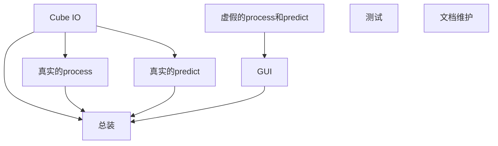

## 任务分配
* 李: cubeIO, process, predict
* 许: GUI, 多线程（明确接口）,负责merge
* 张: 测试，debug，反馈bug
* 洪: 编写文档, 维护代码, 包括维护requirements.txt等
readme.md 接口文档 
1. 张、洪有时候会承担李、许的具体编码任务
2. 李、许要频繁讨论并解决技术问题
## 任务顺序

## 分支管理
1. 远程(`origin`->`master`)：主分支
2. 远程(origin->`dev`): 开发分支
3. 本地(`xxx(千万不要取master)`): 个人分支  
本地xxx->远程dev->远程master
每日开发前先`pull`远程dev，开发完成后发起`pull request`(不要直接push!!然后merge)  
最终版本测试完成后，合并到远程master

## 项目管理和bug追踪
使用jira进行任务管理
https://litchiham.atlassian.net/jira/software/projects/KAN/boards/1